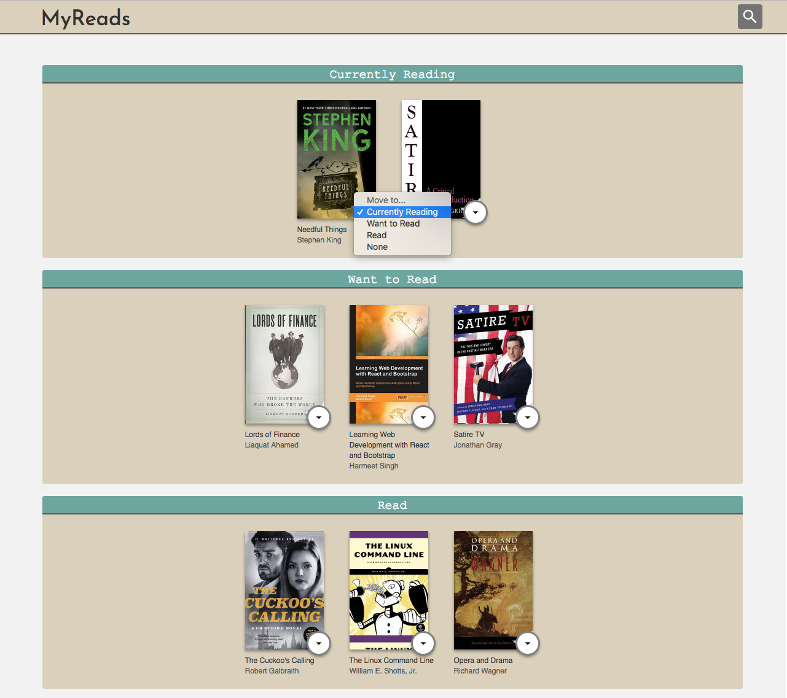
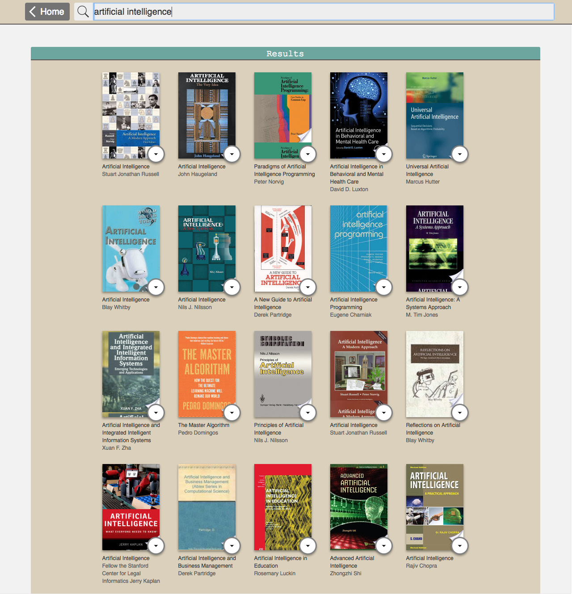

# MyReads Project

## Table of Contents

* [About](#about)
* [How to run it](#how-to-run-it)
* [How to use it](#how-to-use-it)
* [Important](#important)

## About

The **MyReads** project is bookshelf app written with React. You can categorize books you have read, are currently reading, or want to read. The project emphasizes using React to build the application and provides an API server and client library that you will use to persist information as you interact with the application.

## How to run it

1) Download or Clone the repository
2) Unzip the file if you have downloaded a ZIP
3) Install dependencies using **npm**:

        npm install

4) Start the application:

        npm start

5) This will open new browser window/tab. If it doesn't navigate to 

        http://localhost:3000/

## How to use it

On the Home page you have three sorted categories:

* Currently Reading
* Want to Read
* Read

To change/remove book from a category/shelf click on the arrow icon on the book cover

***

On the Search Page you can add new books by enter an author's name or subject in the search field

*Note: The backend API is limited to a fixed set of [Search Terms](#important)  -- see below for valid search options*

## Important

Important
The backend API uses a fixed set of cached search results and is limited to a particular set of search terms, which can be found in [SEARCH_TERMS.md](SEARCH_TERMS.md). That list of terms are the only terms that will work with the backend, so don't be surprised if your searches for Basket Weaving or Bubble Wrap don't come back with any results.